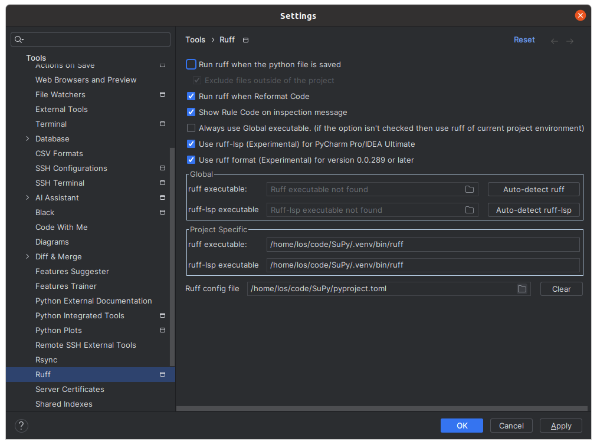

# SuPy

## Dependencies

- Python version >= 3.11
- [poetry](https://python-poetry.org/) (install e.g.
  [using `pipx`](https://python-poetry.org/docs/#installing-with-pipx))

## Installation

Clone the git repository:
```
git clone https://github.com/marcinlos/SuPy.git
```
Resolve and download dependencies:
```
poetry install
```
Activate the virtual environment:
```
poetry shell
```
Recreate notebook files using Jupytext:
```
jupytext --sync scripts/*.py
```
(optional) Activate pre-commit hooks:
```
pre-commit install
```

## Project structure

- `src/` - library code
- `data/` - data files, like ground truth observations
- `scripts/` - percent scripts representing notebooks (paired using Jupytext)
- `notebooks/` - notebooks pared with python files in `scripts/`

Notebooks (.ipynb files) should not be directly stored in version control.

## Useful commands

Activate virtual environment:
```
poetry shell
```

Start the Jupyter server:
```
jupyter lab
```

### Project management

Add a dependency:
```
poetry add <library-name>
```

Add a development dependency:
```
poetry add <tool-name> --group dev
```

### Notebooks infrastructure

Rebuild notebook(s) from percent scripts:
```
jupytext --sync [paths of .py files]
```

Diff notebook files in terminal:
```
nbdiff <path/to/first.ipynb> <path/to/second.ipynb>
```
or using a web-based interface:
```
nbdiff-web <path/to-first.ipynb> <path/to/second.ipynb>
```

Display notebooks in terminal:
```
nbshow <path/to/notebook.ipynb>
```

Convert notebook with outputs to html:
```
jupyter nbconvert --to html <path/to/notebook.ipynb>
```

Convert only notebook outputs to html:
```
jupyter nbconvert --no-input --to html <path/to/notebook.ipynb>
```

Execute notebook and convert notebook with outputs to html:
```
jupyter nbconvert --execute --to html <path/to/notebook.ipynb>
```

### Code quality related tasks

Run pre-commit hooks on all files:
```
pre-commit run --all-files
```

Run linter:
```
ruff check
```

Run ruff formatter (not used currently):
```
ruff format
```

## Ruff with PyCharm

To use ruff formatter from PyCharm:

- install [Ruff plugin](https://plugins.jetbrains.com/plugin/20574-ruff) for PyCharm
- open the plugin settings (`Settings` - `Tools` - `Ruff`)
- make sure the project-specific ruff executable is correctly determined
- set `Ruff config file` to `pyproject.toml`
- make sure `Use ruff format (Experimental)` is checked

After these changes, PyCharm's `Refactor code` action should use ruff formatter.



(tested with PyCharm 2023.3.3 Professional Edition)
